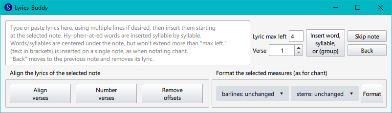
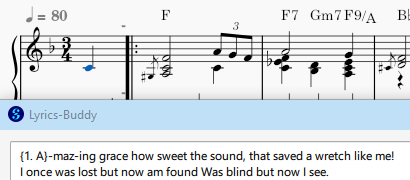
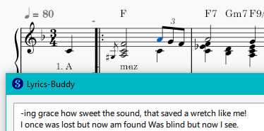
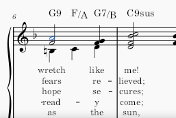
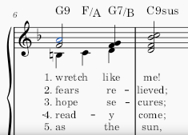

## What is this ?

This is a [MuseScore](https://handbook.musescore.org/) [plugin](https://musescore.org/en/plugins) which assists in the insertion and formatting of lyrics.

MuseScore's built-in lyrics entry is quite usable, letting you type or paste lyrics one word or syllable at a time. If the clipboard contains hyphenated words, MuseScore will automatically insert the hyphen as you insert each syllable.

Lyrics-buddy adds a few conveniences to entry and formatting of lyrics:

- Allows you to see the lyrics waiting to be inserted (rather than the invisible clipboard)
- Allows you to modify the lyrics waiting to be pasted after you mess up inertion
- MuseScore defaults to centering each word or syllable under its note. This is usually fine, but it can sometimes cause the text to appear too far to the left of the note. Lyrics-buddy lets you specify a "left max" value to limit how far to the left of a note its lyrics may extend.
- When notating chant, it is common to have multiple words on the same note. You can do this in MuseScore by typing Ctrl-Space instead of Space between words, but this can make typing cumbersome. Lyrics-buddy will insert text wrapped in curly braces {} onto a single note.
- Lets you align and number the text of multiple verses

## Installation

Current and previous versions are available for download from [https://github.com/OldBaldGeek/MuseScore-goodies/tree/main/lyrics-buddy](https://github.com/OldBaldGeek/MuseScore-goodies/tree/main/lyrics-buddy).

Unpack the zip file. Move the `lyric-buddy` folder to MuseScore's plugins folder. This is configurable at `Preferences:General:Folders`. The default directories are:
- `Windows: C:\Users\%USERNAME%\Documents\MuseScore4\Plugins`
- `macOS: ~/Documents/MuseScore4/Plugins`
- `Linux: ~/Documents/MuseScore4/Plugins`

Click `Plugins`, `Manage plugins...` and `Enable` the plugin.

To update to a new version, simply replace the `lyrics-buddy` folder with the new one. You may need to restart Musescore.

## Operation

The Lyrics-buddy dialog has several sections:

### Insertion of Lyrics

- **Type or paste Lyrics here...** is a multi-line text box into which you can type or paste lyrics. I like to use the "Hyphenator" at https://juiciobrennan.com/hyphenator/ to hyphenate a verse of lyrics, then copy the results to Lyrics-buddy. The Hyphenator isn't perfect but does a pretty good job.

- **Insert word, syllable, or \{group\}**: Button that adds the next lyric item to the currently selected note. The selection is then moved to the next note, and the lyric item just inserted is removed from the source text box. If a lyric already exists for the specified verse of the selected note, an error is shown and no lyric is inserted.
  

- **Skip note**: Button that advances the selection to the next note without inserting a lyric item. Used to skip over tied notes and melissmas.

- **Back**: Button that moves the selection back to the previous note, removes its lyric, and pre-pends the lyric to the source text box. Useful as an "undo" when you insert into what should be a tied note or melissma.

- **Lyric max left**: numeric edit field that specifies the maximum distance to the left of a note that a lyric will be allowed to extend. By default, MuseScore centers each lyric on its note. Lyrics-buddy uses **Lyric max left** to limit how far left each lyric is allowed to extend. The default value is 4, which is roughly 4 characters. If you don't like the feature, set it to 999.

- **Verse**: specifies the verse to which lyrics should be added or from which they should be removed.

### Align the lyrics of the selected note

If your score has multiple verses, this section can help with formatting them. As mentioned above, MuseScore's default (and common practice in hymnals and the like) is to center most words or syllables on the note they are attached to. But much published music aligns the first lyrics on a line for a cleaner appearance, especially when there are multiple verses.

- **Align verse**: button that aligns the left edge of all verses on the selected note, taking into account "Lyric max left". This will most often be used on the first note of a line, following common publishing practice. Note that even if you have only a single verse this button may be used to apply "Lyric max left" to an existing lyric on a note.

- **Number verses**: button that numbers the verses on the selected note and aligns the numbers. You will almost always do this on the first line of music. But for songs with more than four verses your singers will appreciate it if you add numbers to the first word in each line, to make it easier to find verse 5 of 9 across a line break.
    

- **Remove offsets**: Lyrics-buddy does its alignments by adjusting the Lyric's offsetX property. Should these get messed up, perhaps by an earlier manual adjustment of the lyric in one verse, this button sets offsetX of all Lyrics attached to the selected note to 0.

### Format the selected measures (as for chant)
These controls don't affect lyrics. They are tucked in a corner here because I engrave a fair amount of non-metrical chant and they let me avoid needing to open an additional plug-in. (Chant is also why Lyrics-buddy has {} groups for lyrics text.)

Unlike the other sections of the dialog that act on one note at a time, the controls here act on a selection, typically a range of measures or an entire score.

- **barlines:...** drop-list that specifies whether barlines should be affected by Format, and if so what type of barline is to be used: normal, tick1, or tick2.

- **stems:...** drop-list that specifies whether note stems should be affected by Format, and if so what type of stem is to be used: normal or none.

- **Format**: button to apply the specified barline and note stem selections to the selected measures.

## Notes and Limitations

Lyrics-buddy was written to simplify my workflow when using my score styles. I do not guarantee that it will work with your workflow or MuseScore settings.
